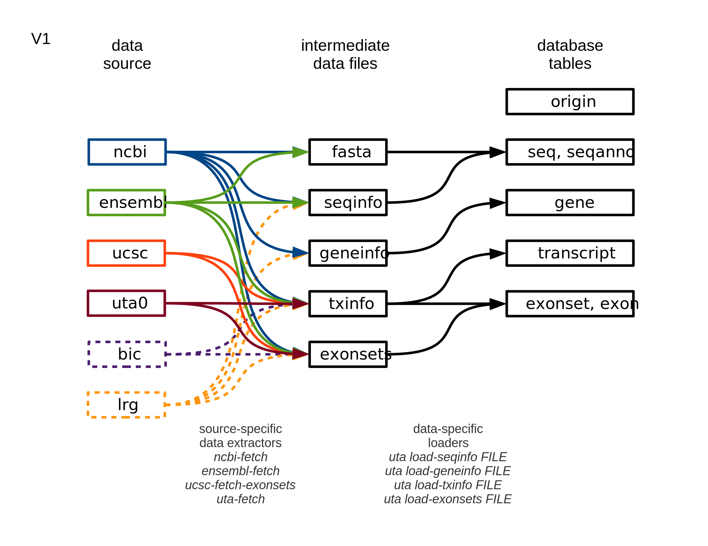

.. _db_loading.rst:

Loading UTA
===========

These docs are in flux as the database loading process matures.

Overview
--------

Loading occurs in three distinct stages:

  1. extraction and translation from data sources into intermediate files;
  2. loading from intermediates into UTA;
  3. generating new exon alignments within UTA.

The extraction/translation scripts, which are specific for each
source, are in uta/sbin/. Each script reads from one source and writes
one or more intermediates in formats that are specified in
uta/formats/.  The intermediate file formats are indpendent of source.

Loading is largely driven by loading/Makefile.

Updated 2014-08-29
Tested with Ubuntu 14.04, x86_64, PostgreSQL 9.3.4

Preparing a PostgreSQL cluster and database
-------------------------------------------

You may specify certain PostgreSQL options using environment variables
or command line options. For readability, these instructions use
environment variables:

::

    export PGDATA=/local/home/reece/var/pg/9.3-test
    export PGHOST=localhost
    export PGPORT=5432
    export PGDATABASE=uta_dev

First, create the PostgreSQL cluster if you do not have one already
installed::

    initdb -D $PGDATA
    perl -i.bak -pe "s/#port = 5432/port = $PGPORT/" $PGDATA/postgresql.conf
    pg_ctl -D $PGDATA -l logfile start

By default, PostgreSQL specifies local "trust" authentication in
pg_hba.conf and is required for these instructions.

Then, create users and a uta database::

    createuser uta_admin
    createuser uta_public
    createdb -O uta_admin uta_dev

Install UTA
-----------

The scripts necessary to build the UTA database are in the UTA repo.

::

    mkvirtualenv uta
    hg clone ssh://hg@bitbucket.org/biocommons/uta uta_dev
    cd uta_dev
    make develop
    # TODO: error the first time (re: distribute package). Second time was clean. Figure this out.
    make develop

Prepare intermediate files
--------------------------

Sequences
^^^^^^^^^

UTA requires sequence data for every sequence that is referenced in
the intermediate files. Fasta files (with .fa, .fna, .faa, or .fasta
filename extensions) should be placed at the root of a single
directory.  The path is specified in etc/global.conf.

    [sequences]
    fasta_directory = /locus/data/core-rest/2014-01/sequences

NCBI
^^^^

Data from NCBI are pulled using tools in a separate repo. Briefly:

* Clone https://bitbucket.org/biocommons/mirrors-ncbi

* Type `make update`

  When this is completed, you will have a dated snapshot of NCBI data used by UTA.

* Make a symlink to the source data directory::

  cd loading/aux
  ln -s ../../../mirrors-ncbi # adjust as necessary

* The loading makefile will pull data from that source as necessary

Ensembl
^^^^^^^

LRG
^^^

Preparing to load the whole kielbasa
^^^^^^^^^^^^^^^^^^^^^^^^^^^^^^^^^^^^

::

    make main-data

This will take a long time. 36 hours maybe.

Preparing test data
^^^^^^^^^^^^^^^^^^^

These data are used for testing and therefore committed with the repo.
You probably don't need to rebuild them.

::

    make test-data

Data Loading
------------

The general command to load data is::

    cd loading
    make uta-build DATA=<dataset> CONF=<confname>

DATA specifies a directory of intermediate files in loading/<dataset> to be loaded

CONF specifies a config file in ../etc/ for connection parameters

Testing Loading
^^^^^^^^^^^^^^^

uta/loading/test contains a set of intermediate files to test the
loading process. These files are part of the UTA repository. 

For testing, type::

    make uta-build DATA=test CONF=test

If that fails::

    psql -p $PGPORT -d <db> -c 'drop schema uta1 cascade'
    make cleanest

and retry.

Create and load a database
^^^^^^^^^^^^^^^^^^^^^^^^^^

::

    make uta-build DATA=main CONF=dev

Push to RDS
-----------

The current practice is to dump UTA, then restore to Amazon RDS for
the public instance (uta.invitae.com).

::

    sname=uta_20150527
    pg_dump -d uta_dev -n $sname | gzip -c > dumps/$sname.pgd.gz
    gzip -cd <$sname.pgd.gz | psql -h uta.invitae.com -U uta_admin

The dump and restore each take ~5 minutes.  If you don't care about
the intermediate, you can pipe directly of course.

